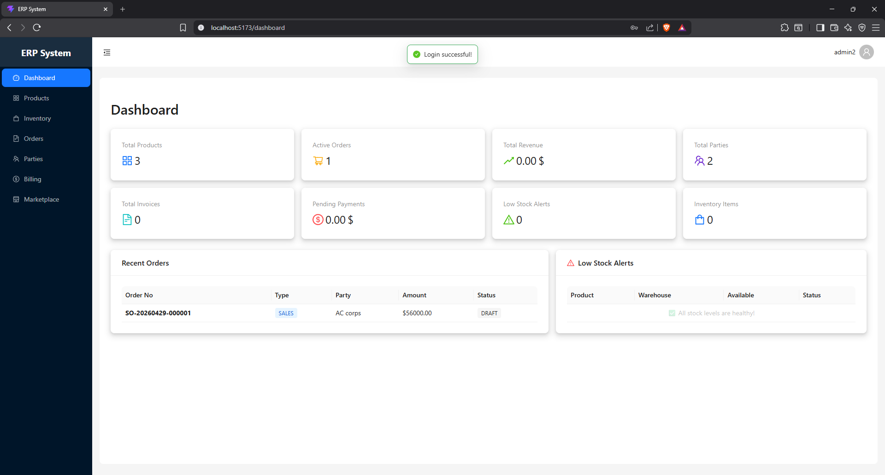

This is the README.md file

# Erp Software

A full-stack Enterprise Resource Planning (ERP) system built with Spring Boot and React. Covers core business operations including inventory, billing, order management, party (customer/vendor) management, and a B2B marketplace.

---

## Tech Stack

**Backend**
- Java 17, Spring Boot 4.0.2
- Spring Security (JWT-based authentication)
- Spring Data JPA + Hibernate
- PostgreSQL
- Flyway (database migrations)
- Lombok, SpringDoc OpenAPI (Swagger UI)
- Maven

**Frontend**
- React 19 + TypeScript
- Vite
- Ant Design (antd)
- Zustand (state management)
- React Hook Form + Zod
- Axios
- Recharts, jsPDF, html2canvas

---

## Features

- **Authentication** — JWT-based login, BCrypt password hashing, role-based access control
- **Party Management** — Manage customers, vendors, and contacts with address book
- **Product Catalog** — Products with categories, units, SKU/barcode, and price history
- **Inventory** — Multi-warehouse stock tracking, stock-in/out, transfers, and adjustments
- **Order Management** — Sales and purchase orders, status tracking, delivery challans
- **Billing** — Invoice creation, payment recording, payment allocation, overdue tracking
- **B2B Marketplace** — Vendor listings, product inquiries, bulk orders, and vendor reviews
- **Audit Logging** — Automatic audit trails on all entities via `BaseAuditEntity`
- **Notifications** — Multi-channel notification preferences per user

---

## Project Structure

```
ErpSoftware/
├── src/
│   └── main/
│       ├── java/com/erp/system/
│       │   ├── auth/           # Users, roles, parties, JWT config
│       │   ├── billing/        # Invoices, payments
│       │   ├── inventory/      # Warehouses, stock, movements
│       │   ├── order/          # Orders, delivery challans
│       │   ├── product/        # Products, categories, pricing
│       │   ├── marketplace/    # Vendors, listings, bulk orders
│       │   ├── notification/   # Notifications system
│       │   ├── audit/          # Audit logging
│       │   └── common/         # Shared DTOs, exceptions, responses
│       └── resources/
│           ├── application.properties
│           └── db/migration/   # Flyway SQL migrations (V1–V11)
└── erp-frontend/
    └── src/
        ├── pages/              # Billing, inventory, orders, products, parties, marketplace
        ├── services/           # Axios API service layer
        ├── stores/             # Zustand auth store
        ├── types/              # TypeScript type definitions
        └── layouts/            # Dashboard layout
```

---

## Prerequisites

- Java 17+
- Maven 3.8+
- PostgreSQL 14+
- Node.js 18+ and npm

---

## Getting Started

### 1. Database Setup

Create a PostgreSQL database:

```sql
CREATE DATABASE erp_db;
```

### 2. Configure Application

Edit `src/main/resources/application.properties` and update your DB credentials:

```properties
spring.datasource.url=jdbc:postgresql://localhost:5432/erp_db
spring.datasource.username=your_username
spring.datasource.password=your_password
```

Also update the JWT secret:

```properties
app.jwt.secret=your_minimum_32_character_secret_key_here
```

> **Note:** Flyway will automatically run all migrations (`V1` through `V11`) on first startup.

### 3. Run the Backend

```bash
# Build
mvn clean package

# Run
mvn spring-boot:run
```

Backend starts on **http://localhost:8090**

Swagger UI available at: **http://localhost:8090/swagger-ui.html**

### 4. Run the Frontend

```bash
cd erp-frontend
npm install
npm run dev
```

Frontend starts on **http://localhost:5173** (default Vite port)

---

## API Overview

The backend exposes 81 REST endpoints across 9 controllers. All endpoints (except `/api/auth/login`) require a valid JWT Bearer token.

| Module       | Base Path               |
|--------------|-------------------------|
| Auth         | `/api/auth`             |
| Users        | `/api/users`            |
| Roles        | `/api/roles`            |
| Parties      | `/api/parties`          |
| Products     | `/api/products`         |
| Inventory    | `/api/inventory`        |
| Orders       | `/api/orders`           |
| Billing      | `/api/billing`          |
| Marketplace  | `/api/marketplace`      |

Full API documentation is available via Swagger at `/swagger-ui.html` when the server is running.

---

## Authentication

Login to get a JWT token:

```bash
POST /api/auth/login
Content-Type: application/json

{
  "username": "your_username",
  "password": "your_password"
}
```

Use the returned token in all subsequent requests:

```
Authorization: Bearer <token>
```

Tokens expire after 24 hours (`86400000` ms).

---

## Database Migrations

Flyway migrations are located in `src/main/resources/db/migration/`:

| Migration | Description |
|-----------|-------------|
| V1  | Initial schema |
| V2  | Auth base tables |
| V3  | Party tables |
| V4  | Product module |
| V5  | Inventory module |
| V6  | Billing module |
| V7  | Order management |
| V8  | B2B marketplace |
| V9  | Advanced features |
| V10 | Audit columns on address |
| V11 | Seed default roles |

---

## Build Commands

```bash
# Build JAR
mvn clean package

# Run application
mvn spring-boot:run

# Run all tests
mvn test

# Run a specific test class
mvn test -Dtest=ClassName

# Run a specific test method
mvn test -Dtest=ClassName#methodName

# Build frontend for production
cd erp-frontend && npm run build
```

---

## Environment Notes

- Backend port: `8090`
- Frontend dev port: `5173`
- Default DB: `localhost:5432/erp_db`
- API docs: `http://localhost:8090/swagger-ui.html`
- Raw OpenAPI spec: `http://localhost:8090/api-docs`

---

Here Some of it's Screenshots




